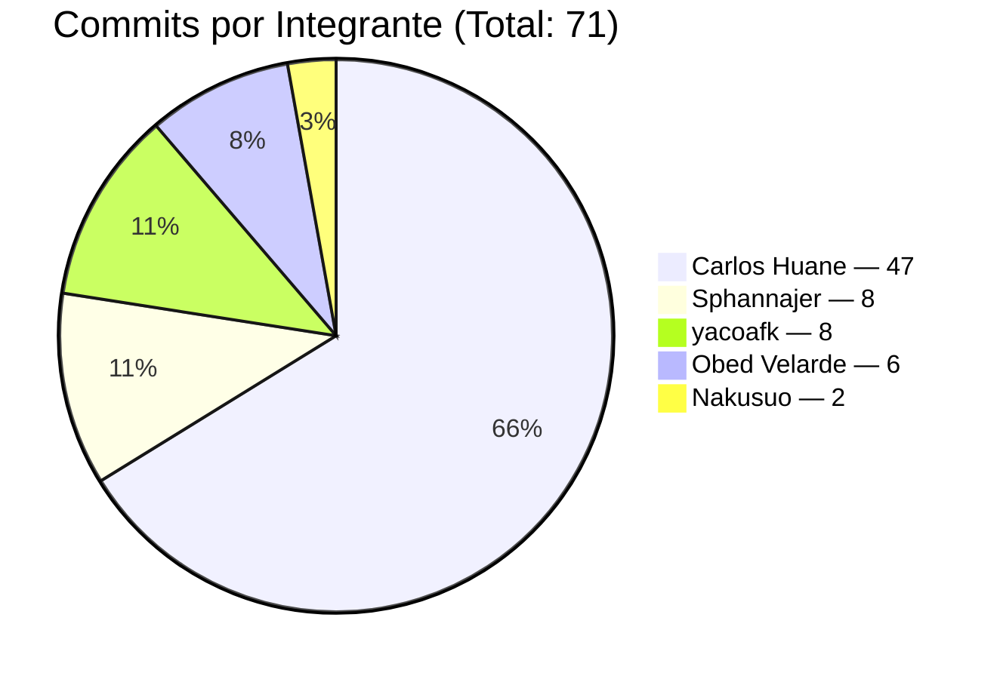
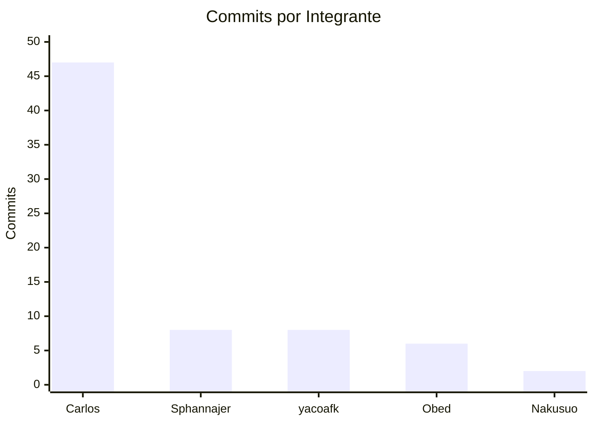
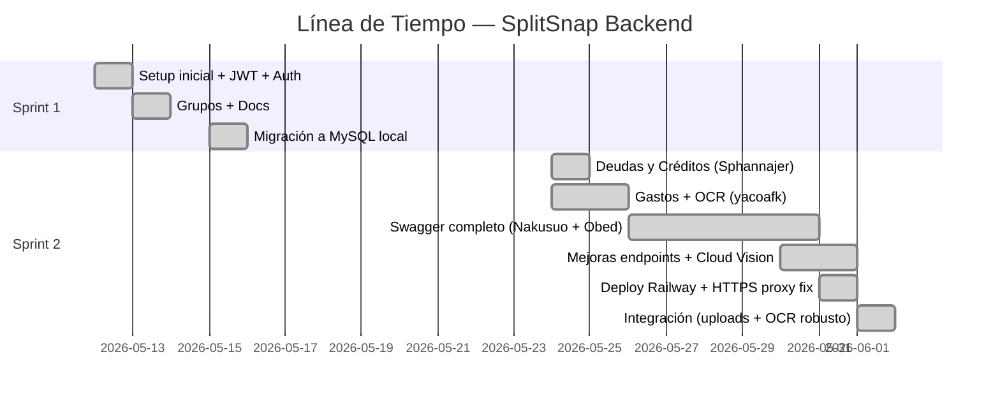

# SplitSnap — Backend

> API REST para SplitSnap, app de gestión de gastos compartidos.
> **Stack:** Java 17 · Spring Boot 3.2 · MySQL 8 · JWT · Swagger/OpenAPI 3 · Google Cloud Vision OCR

---

## Enlaces del Proyecto

| Recurso | Enlace |
|---------|--------|
| Repositorio Backend | https://github.com/Carlos-Huane/SplitSnap-BackEnd |
| Repositorio Frontend | https://github.com/Carlos-Huane/SplitSnap-FrontEnd |
| API en producción (Railway) | https://splitsnap-backend-production-7213.up.railway.app |
| Swagger UI | https://splitsnap-backend-production-7213.up.railway.app/swagger-ui/index.html |
| Gestión de Tareas (Jira) | https://carloshuanesarmiento.atlassian.net/jira/software/projects/SCRUM/boards/1 |
| Product Backlog | [Google Docs](https://docs.google.com/document/d/1zwfa7n6_puNALHguFup8Qa2poQH24fvr/edit?usp=sharing) |

---

## Tabla de Contenidos

1. [Descripción General](#1-descripción-general)
2. [Integrantes del Equipo](#2-integrantes-del-equipo)
3. [Stack Tecnológico](#3-stack-tecnológico)
4. [Estructura del Proyecto](#4-estructura-del-proyecto)
5. [Ramas (Branches)](#5-ramas-branches)
6. [Línea de Tiempo del Desarrollo](#6-línea-de-tiempo-del-desarrollo)
7. [Pull Requests Fusionados](#7-pull-requests-fusionados)
8. [Historial de Commits](#8-historial-de-commits)
9. [Arquitectura](#9-arquitectura)
10. [Endpoints REST](#10-endpoints-rest)
11. [Modelo de Datos](#11-modelo-de-datos)
12. [Manejo de Errores](#12-manejo-de-errores)
13. [Datos de Prueba](#13-datos-de-prueba)
14. [Cómo Ejecutar el Proyecto](#14-cómo-ejecutar-el-proyecto)
15. [Despliegue en Railway](#15-despliegue-en-railway)
16. [Convenciones del Proyecto](#16-convenciones-del-proyecto)

---

## 1. Descripción General

**SplitSnap-BackEnd** es una API REST construida en Spring Boot que da soporte al frontend de SplitSnap. Maneja:

- Registro e inicio de sesión con JWT.
- Gestión de grupos con miembros.
- Registro manual de gastos con división por usuario (splits).
- Cálculo automático de deudas a partir de los splits.
- Pago de deudas (manual o con créditos del sistema).
- Historial consolidado de transacciones del usuario.
- Subida de avatar con almacenamiento estático en `/uploads/`.
- OCR de boletas/recibos vía Google Cloud Vision.
- Documentación interactiva con Swagger UI.

### Estado de épicas (Sprint 1 y 2)

| Épica | Responsable | HU cubiertas | Estado |
|---|---|---|---|
| É1 — Setup inicial | Carlos Huane | Estructura, deps, BD, CORS, errors | ✅ |
| É2 — Autenticación | Carlos Huane | Register, Login, JWT, /users/me, search | ✅ |
| É3 — Grupos | Carlos Huane | CRUD grupos + miembros | ✅ |
| É4 — Gastos + OCR | yacoafk (Yorma) | CreateExpense, splits, deudas auto, OCR | ✅ |
| É5 — Deudas + Créditos | SphannajerFuentes (Dafne) | Listar, mark-paid, pay-credits, compras, historial | ✅ |
| É6 — Swagger | Nakusuo + Obed | @ApiResponses en todos los endpoints | ✅ |
| Deploy Railway | Carlos Huane | Build, Procfile, env vars, X-Forwarded | ✅ |

---

## 2. Integrantes del Equipo

| # | Nombre | GitHub / Email | Rol | Commits |
|---|--------|----------------|-----|---------|
| 1 | **Carlos Huane** | `Carlos-Huane` · `carloshuanesarmiento@gmail.com` | PM / Lead / Setup / Auth / Grupos / Deploy / Integración | 47 |
| 2 | **SphannajerFuentes (Dafne)** | `sphannajerfuentes@gmail.com` | É5 — Deudas y Créditos | 8 |
| 3 | **yacoafk (Yorma)** | `yormancamposortiz713@gmail.com` | É4 — Gastos y OCR | 8 |
| 4 | **Obed Velarde** | `U23225009@utp.edu.pe` | É6 — Swagger (gastos + grupos) | 6 |
| 5 | **Nakusuo (Marcela)** | `Nakusuo` | É6 — Swagger general + apidoc | 2 |

**Total de commits en `develop`:** 71

### Distribución de commits por integrante





---

## 3. Stack Tecnológico

| Herramienta | Versión | Uso |
|-------------|---------|-----|
| Java | 17 | Lenguaje base |
| Spring Boot | 3.2.x | Framework principal |
| Spring Security | 6.x | Filtro JWT y autorización |
| Spring Data JPA + Hibernate | — | ORM con MySQL |
| MySQL | 8.x | Base de datos relacional |
| jjwt | 0.11.x | Generación y validación de JWT |
| Springdoc OpenAPI | 2.x | Swagger UI |
| Google Cloud Vision | google-cloud-vision 3.x | OCR de recibos |
| Lombok | 1.18.x | Boilerplate de getters/setters |
| Maven | 3.9+ | Build y dependencias |
| Jakarta Validation | — | Validación de DTOs |

**Persistencia:**
- BD: `splitsnap_db` (MySQL en local, Railway MySQL en prod).
- Avatares: filesystem local en `uploads/avatars/` (efímero en Railway — ver §15).

**Autenticación:**
- JWT con expiración configurable (24h por defecto).
- Filtro `JwtAuthFilter` setea el `@AuthenticationPrincipal` en cada request autenticada.

---

## 4. Estructura del Proyecto

```
splitsnap-backend/
├── docs/
│   ├── apidoc/                 # Documentación estática generada
│   ├── schema.sql              # Esquema SQL de referencia
│   ├── SETUP-LOCAL.md          # Guía detallada
│   └── COMO-IMPLEMENTAR-ENDPOINT.md
├── src/
│   ├── main/
│   │   ├── java/com/splitsnap/
│   │   │   ├── config/
│   │   │   │   ├── CorsConfig.java
│   │   │   │   ├── SecurityConfig.java
│   │   │   │   ├── SwaggerConfig.java
│   │   │   │   ├── StaticResourceConfig.java   # Sirve /uploads/**
│   │   │   │   └── DataInitializer.java        # Seed de usuarios y grupos
│   │   │   ├── controller/
│   │   │   │   ├── AuthController.java
│   │   │   │   ├── UserController.java
│   │   │   │   ├── GroupController.java
│   │   │   │   ├── ExpenseController.java
│   │   │   │   ├── DebtController.java
│   │   │   │   ├── CreditController.java
│   │   │   │   ├── TransactionController.java
│   │   │   │   └── OcrController.java
│   │   │   ├── dto/
│   │   │   │   ├── auth/        # AuthResponse, LoginRequest, RegisterRequest
│   │   │   │   ├── user/        # UserResponse, UpdateProfileRequest
│   │   │   │   ├── group/       # GroupResponse, GroupMemberResponse, CreateGroupRequest, AddMemberRequest
│   │   │   │   ├── expense/     # CreateExpenseRequest, ExpenseResponse, ExpenseDetailResponse, OcrResponse
│   │   │   │   ├── debt/        # DebtResponse, MarkAsPaidRequest, UserDebtInfoDTO
│   │   │   │   ├── credit/      # BuyCreditsRequest, TransactionResponse
│   │   │   │   └── transaction/ # TransactionHistoryDTO
│   │   │   ├── exception/
│   │   │   │   ├── GlobalExceptionHandler.java
│   │   │   │   ├── BusinessException.java
│   │   │   │   ├── EntityNotFoundException.java
│   │   │   │   ├── ResourceNotFoundException.java
│   │   │   │   ├── UnauthorizedException.java
│   │   │   │   └── ErrorResponse.java
│   │   │   ├── model/
│   │   │   │   ├── User.java
│   │   │   │   ├── Group.java
│   │   │   │   ├── GroupMember.java + GroupMemberId.java
│   │   │   │   ├── Expense.java + ExpenseSplit.java
│   │   │   │   ├── Debt.java
│   │   │   │   └── CreditTransaction.java
│   │   │   ├── repository/
│   │   │   │   ├── UserRepository.java
│   │   │   │   ├── GroupRepository.java + GroupMemberRepository.java
│   │   │   │   ├── ExpenseRepository.java + ExpenseSplitRepository.java
│   │   │   │   ├── DebtRepository.java
│   │   │   │   └── CreditTransactionRepository.java
│   │   │   ├── security/
│   │   │   │   ├── JwtService.java          # Generación y parsing de JWT
│   │   │   │   └── JwtAuthFilter.java       # Filtro Spring Security
│   │   │   └── service/
│   │   │       ├── AuthService.java
│   │   │       ├── UserService.java
│   │   │       ├── GroupService.java
│   │   │       ├── ExpenseService.java       # Incluye procesador OCR
│   │   │       ├── DebtService.java
│   │   │       ├── CreditService.java
│   │   │       └── TransactionService.java
│   │   └── resources/
│   │       ├── application.properties
│   │       └── application-prod.properties   # Override Railway si aplica
│   └── test/
│       └── resources/
│           └── application.properties        # H2 in-memory para tests
├── uploads/avatars/                          # Avatares subidos (gitignored)
├── .env.example                              # Plantilla credenciales locales
├── .vscode/launch.json.example
├── pom.xml
├── Procfile                                  # Para Railway
└── README.md
```

---

## 5. Ramas (Branches)

### Ramas activas en el repositorio

| Rama | Propósito | Estado |
|------|-----------|--------|
| `main` | Producción estable (Railway despliega desde aquí) | Activa |
| `develop` | Integración del equipo | Activa |
| `docs/readme-completo` | Esta documentación | En revisión |

### Ramas de funcionalidad (Sprint 1 y 2)

| Rama | Responsable | Épica / Cambio | PR |
|------|-------------|-----------------|----|
| `feature/setup-inicial-backend` | Carlos | É1 — Estructura + Maven + BD + JWT skeleton | #1 |
| `feature/autenticacion-backend` | Carlos | É2 — `/auth/{register,login}`, `/users/me`, búsqueda | #2 |
| `feature/grupos-backend` | Carlos | É3 — CRUD grupos + miembros | #3 |
| `feat/documentacion` | Carlos | Guía SETUP-LOCAL + COMO-IMPLEMENTAR | #4 |
| `feature/config-local-db` | Carlos | Migración a MySQL + `.env` local | #6 |
| `feaute/deudas` *(sic)* | Sphannajer | É5 — HU 5.1 a 5.6 (deudas, créditos, transacciones) | #7 |
| `feature/gastos-backend` | yacoafk | É4 — SCRUM-96 a 100 (expenses + OCR) | #8 |
| `feature/Swagger-completo` | Nakusuo / Obed | Documentación Swagger + apidoc | #9, #10 |
| `feat/mejoras-endpoints` | Carlos | Ajustes endpoints contra spec del BACKLOG | #11 |
| `feature/railway-deploy-config` | Carlos | Build Railway + Cloud Vision env JSON | #13 |
| `fix/swagger-https-railway` | Carlos | `X-Forwarded-Proto` para HTTPS detrás de proxy | #15 |
| `fix/integracion-backend` | Carlos | `/uploads/**` estático + parser OCR robusto | #17 |

**Total de PRs cerrados:** 12.

---

## 6. Línea de Tiempo del Desarrollo



---

## 7. Pull Requests Fusionados

| PR | Rama | Fecha | Descripción |
|----|------|-------|-------------|
| #1 | `feature/setup-inicial-backend` | 2026-05-12 | Spring Boot inicial, JWT skeleton, Auth + Users + Swagger config |
| #2 | `feature/autenticacion-backend` | 2026-05-13 | Schemas + ejemplos para Swagger UI |
| #3 | `feature/grupos-backend` | 2026-05-13 | É3 — entidades, repos, service y controller de grupos |
| #4 | `feat/documentacion` | 2026-05-13 | Guías SETUP-LOCAL y COMO-IMPLEMENTAR-ENDPOINT |
| #6 | `feature/config-local-db` | 2026-05-15 | Migración a MySQL con `.env` local y semilla |
| #7 | `feaute/deudas` | 2026-05-24 | É5 — HU 5.1 a 5.6 (deudas, créditos, transacciones) |
| #8 | `feature/gastos-backend` | 2026-05-25 | É4 — Expenses con splits, deudas auto, detalle, OCR Google Vision |
| #9 | `feature/Swagger-completo` | 2026-05-30 | Documentación apidoc + comentarios @api |
| #10 | `feature/Swagger-completo` | 2026-05-30 | Swagger UI: descripciones, respuestas, ejemplos |
| #11 | `feat/mejoras-endpoints` | 2026-05-31 | Refactor para alinear con BACKLOG + cleanup |
| #13 | `feature/railway-deploy-config` | 2026-05-31 | Procfile, build, GOOGLE_APPLICATION_CREDENTIALS_JSON |
| #15 | `fix/swagger-https-railway` | 2026-05-31 | `server.forward-headers-strategy=framework` |
| #17 | `fix/integracion-backend` | 2026-06-01 | Servir `/uploads/**` + parser OCR para boletas SUNAT peruanas |

---

## 8. Historial de Commits

| Hash | Autor | Fecha | Mensaje |
|------|-------|-------|---------|
| `3f63a1a` | Carlos | 2026-06-01 | fix(integracion): servir avatares estaticos y mejorar parser OCR |
| `a92d082` | Carlos | 2026-05-31 | fix(swagger): respetar X-Forwarded-Proto en Railway/proxies HTTPS |
| `06dd3a1` | Carlos | 2026-05-31 | feat(deploy): preparar backend para deploy en Railway |
| `6c05014` | Carlos | 2026-05-31 | chore(config): integrar Google Cloud Vision OCR |
| `c20b9d4` | Carlos | 2026-05-30 | docs(swagger): completar @ApiResponses en todos los endpoints |
| `110b0be` | Obed | 2026-05-30 | docs(swagger): mejorar documentacion de endpoints de gastos |
| `3d8f069` | Obed | 2026-05-30 | docs(swagger): documentar respuestas HTTP de grupos |
| `a9f1754` | Obed | 2026-05-30 | docs(swagger): ampliar descripcion de endpoints de grupos |
| `c8ccb0f` | Obed | 2026-05-30 | docs(swagger): agregar documentacion externa a OpenAPI |
| `b7c9b12` | Carlos | 2026-05-30 | refactor: alinear endpoints con la spec del BACKLOG |
| `4080562` | Nakusuo | 2026-05-26 | docs: agregar documentación estática con apidoc |
| `3d2d328` | Nakusuo | 2026-05-26 | Mejora en el Swagger |
| `6205c7f` | yacoafk | 2026-05-25 | resolucion de conflictos en gastos |
| `259c8af` | yacoafk | 2026-05-24 | feat: integracion real de OCR con Google Cloud Vision (SCRUM-100) |
| `a361910` | yacoafk | 2026-05-24 | feat: consulta de detalle de un gasto con sus splits (SCRUM-99) |
| `acb2133` | yacoafk | 2026-05-24 | feat: listado de gastos por grupo ordenados por fecha (SCRUM-98) |
| `8a6eb4e` | yacoafk | 2026-05-24 | feat: calcular y generar deudas automaticamente (SCRUM-97) |
| `1d9fb9e` | yacoafk | 2026-05-24 | feat: completar registro de gasto manual y validaciones (SCRUM-96) |
| `816cf04` | Sphannajer | 2026-05-24 | Realizando HU 5.6 Historial completo del usuario |
| `b805105` | Sphannajer | 2026-05-24 | HU 5.4 historial de créditos completado y comprobado |
| `7ecf823` | Sphannajer | 2026-05-24 | HU 5.5 compra de créditos verificado con postman |
| `2837daf` | Sphannajer | 2026-05-24 | HU 5.3 pagos con créditos |
| `74eb109` | Sphannajer | 2026-05-24 | HU 5.2 marcar pagado completado |
| `c5b8ce0` | Sphannajer | 2026-05-24 | HU 5.1 resumen de deudas completado |
| `1d23092` | Carlos | 2026-05-15 | chore: migrar a MySQL con config local via .env |
| `b667712` | Carlos | 2026-05-13 | fix: usar @Query explícito en GroupMemberRepository |
| `514914f` | Carlos | 2026-05-13 | feat: implementar GroupController con los 5 endpoints de É3 |
| `70ef838` | Carlos | 2026-05-13 | feat: GroupService con lógica de creación y miembros |
| `ee12e58` | Carlos | 2026-05-13 | feat: DTOs de grupos |
| `6fc05aa` | Carlos | 2026-05-13 | feat: entidades Group y GroupMember con clave compuesta |
| `a636608` | Carlos | 2026-05-13 | feat: ejemplos @Schema en DTOs para Swagger UI |
| `a67c9db` | Carlos | 2026-05-12 | feat: configurar Swagger con autenticación Bearer JWT |
| `ce2c299` | Carlos | 2026-05-12 | feat: perfil de usuario, edición y búsqueda |
| `468734a` | Carlos | 2026-05-12 | feat: autenticación JWT y protección de endpoints |
| `0ae9cbf` | Carlos | 2026-05-12 | feat: registro e inicio de sesión |
| `64a3b0d` | Carlos | 2026-05-12 | docs: guía de instalación y flujo de desarrollo |
| `c3876b1` | Carlos | 2026-05-12 | feat: CORS para desarrollo local |
| `a6a47e1` | Carlos | 2026-05-12 | feat: manejador global de excepciones |
| `20b8abb` | Carlos | 2026-05-12 | feat: esquema SQL de base de datos |
| `138ec2d` | Carlos | 2026-05-12 | feat: configurar conexión a base de datos |
| `fa51a5c` | Carlos | 2026-05-12 | feat: inicializar proyecto Spring Boot con dependencias |

> Historial completo en `git log --all` o en GitHub.

---

## 9. Arquitectura

### Capas

```
┌────────────────────────────────────────────────────────────┐
│  Controller   ← @RestController, recibe HTTP               │
│      ↓                                                     │
│  Service      ← @Service, lógica de negocio + @Transactional│
│      ↓                                                     │
│  Repository   ← interface JpaRepository<Entity, UUID>      │
│      ↓                                                     │
│  Model        ← @Entity con relaciones JPA                 │
└────────────────────────────────────────────────────────────┘

DTO (request / response) ← capa de tipos entre Controller y Service
GlobalExceptionHandler ← traduce excepciones a JSON estándar con HTTP correcto
JwtAuthFilter ← intercepta header Authorization, setea @AuthenticationPrincipal
```

### Mapeo de excepciones → HTTP

| Excepción Java | HTTP | Cuándo se lanza |
|---|---|---|
| `EntityNotFoundException` | 404 | Entidad no encontrada (grupo, gasto, usuario) |
| `ResourceNotFoundException` | 404 | Recurso no encontrado en el contexto |
| `UnauthorizedException` | 401 | (reservado para usos específicos) |
| `AccessDeniedException` | 403 | Falta permiso (solo deudor puede marcar pagado, etc.) |
| `BusinessException` | 400 | Validación de negocio (créditos insuficientes, email en uso, etc.) |
| `IllegalArgumentException` | 400 | Argumentos inválidos |
| `IllegalStateException` | 409 | Conflicto de estado (deuda ya pagada) |
| `MethodArgumentNotValidException` | 400 | Validación de DTOs (@Valid) |
| `Exception` (catch-all) | 500 | Error inesperado |

### Seguridad

- `SecurityConfig.filterChain` permite sin auth: `/api/auth/**`, `/uploads/**`, `/swagger-ui/**`, `/api-docs/**`, `/v3/api-docs/**`, `/webjars/**`.
- Todo lo demás requiere `Bearer <JWT>`.
- `JwtAuthFilter`:
  1. Extrae el header `Authorization`.
  2. Valida el token con `JwtService.isTokenValid`.
  3. Busca el `User` con el `sub` del token.
  4. Setea `Authentication` en el `SecurityContextHolder`.
- Los controladores acceden al user actual con `@AuthenticationPrincipal User user`.

### JWT — claims

```json
{
  "sub": "30e16c40-b1a8-4266-9701-b0ccc3cb39cf",   // UUID del usuario
  "email": "carlos@splitsnap.com",
  "name": "Carlos Huane",
  "iat": 1718000000,
  "exp": 1718086400                                  // +24h
}
```

---

## 10. Endpoints REST

### Auth (público)

| Método | Ruta | Body | Response | Notas |
|---|---|---|---|---|
| POST | `/api/auth/register` | `{ name, email, phone?, password }` | `{ token, user }` | 201 / 400 / 409 |
| POST | `/api/auth/login` | `{ email, password }` | `{ token, user }` | 200 / 401 |

### Users (autenticado)

| Método | Ruta | Body / Query | Response |
|---|---|---|---|
| GET | `/api/users/me` | — | `UserResponse` |
| PUT | `/api/users/me` | `UpdateProfileRequest` | `UserResponse` (200 / 400 / 409) |
| PUT | `/api/users/me/avatar` | `multipart/form-data` con `file` | `{ avatarUrl }` |
| GET | `/api/users/search` | `?q=<min 2 chars>` | `[UserResponse, ...]` |

### Groups (autenticado)

| Método | Ruta | Body | Response |
|---|---|---|---|
| GET | `/api/groups` | — | `[GroupResponse, ...]` |
| POST | `/api/groups` | `CreateGroupRequest` | `GroupResponse` (201) |
| GET | `/api/groups/{groupId}` | — | `GroupResponse` (200 / 404) |
| POST | `/api/groups/{groupId}/members` | `AddMemberRequest` | `GroupResponse` (200 / 400 / 404) |
| DELETE | `/api/groups/{groupId}/members/{userId}` | — | 204 (403 si no es creador) |

### Expenses (autenticado)

| Método | Ruta | Body | Response |
|---|---|---|---|
| POST | `/api/groups/{groupId}/expenses` | `CreateExpenseRequest` | `ExpenseResponse` (201) |
| GET | `/api/groups/{groupId}/expenses` | — | `[ExpenseResponse, ...]` |
| GET | `/api/groups/{groupId}/expenses/{expenseId}` | — | `ExpenseDetailResponse` |

### OCR (autenticado)

| Método | Ruta | Body | Response |
|---|---|---|---|
| POST | `/api/ocr/scan` | `multipart/form-data` con `file` | `OcrResponse` |

### Debts (autenticado)

| Método | Ruta | Body | Response |
|---|---|---|---|
| GET | `/api/groups/{groupId}/debts` | `?status=PENDING\|PAID` | `[DebtResponse, ...]` |
| PUT | `/api/groups/{groupId}/debts/{debtId}/mark-paid` | `{ paidWith }` | `DebtResponse` (200 / 403 / 409) |
| PUT | `/api/groups/{groupId}/debts/{debtId}/pay-credits` | — | `DebtResponse` (200 / 400 / 403 / 409) |

### Credits (autenticado)

| Método | Ruta | Body | Response |
|---|---|---|---|
| GET | `/api/users/me/credits` | — | `{ balance, history: [TransactionResponse, ...] }` |
| POST | `/api/users/me/credits/buy` | `{ amount }` | `{ message, newBalance }` |

### Transactions (autenticado)

| Método | Ruta | Body | Response |
|---|---|---|---|
| GET | `/api/users/me/transactions` | `?groupId=&type=expense\|payment` | `[TransactionHistoryDTO, ...]` |

### Avatares estáticos (público)

| Método | Ruta | Response |
|---|---|---|
| GET | `/uploads/avatars/{filename}` | imagen (servida por `StaticResourceConfig`) |

---

## 11. Modelo de Datos

### Tablas principales

```
users
├── id (UUID, PK)
├── name (VARCHAR)
├── email (VARCHAR, UNIQUE)
├── phone (VARCHAR, nullable)
├── password (VARCHAR, BCrypt)
├── avatar_url (VARCHAR, nullable)
└── credits (DECIMAL)

groups
├── id (UUID, PK)
├── name (VARCHAR)
├── emoji (VARCHAR, default '📦')
├── created_by (UUID, FK users)
└── created_at (TIMESTAMP)

group_members  (clave compuesta GroupMemberId(groupId, userId))
├── group_id (UUID, FK groups)
└── user_id (UUID, FK users)

expenses
├── id (VARCHAR(36) UUID, PK)
├── description (VARCHAR)
├── amount (DECIMAL)
├── group_id (UUID, FK groups)
├── paid_by (UUID, FK users)
├── created_by (UUID, FK users)
├── expense_date (DATE)
└── created_at (TIMESTAMP)

expense_splits
├── id (autoincr, PK)
├── expense_id (FK expenses)
├── user_id (FK users)
└── amount (DECIMAL)

debts
├── id (VARCHAR(36), PK)
├── group_id (UUID, FK groups)
├── expense_id (VARCHAR(36), FK expenses)
├── from_user (UUID, FK users)
├── to_user (UUID, FK users)
├── amount (DECIMAL)
├── status (ENUM: 'PENDING' | 'PAID')
├── paid_at (TIMESTAMP, nullable)
└── paid_with (VARCHAR, nullable — 'yape' | 'paypal' | 'efectivo' | 'credits')

credit_transactions
├── id (VARCHAR(36), PK)
├── user_id (UUID, FK users)
├── amount (DOUBLE)
├── type (ENUM: 'PURCHASE' | 'SPEND')
├── debt_id (VARCHAR(36), nullable — solo si type = SPEND)
└── created_at (TIMESTAMP)
```

### Relaciones

```mermaid
erDiagram
    USERS ||--o{ GROUPS : creates
    USERS ||--o{ GROUP_MEMBERS : belongs_to
    GROUPS ||--o{ GROUP_MEMBERS : has
    GROUPS ||--o{ EXPENSES : contains
    USERS ||--o{ EXPENSES : pays
    EXPENSES ||--o{ EXPENSE_SPLITS : split_into
    USERS ||--o{ EXPENSE_SPLITS : owes_share
    EXPENSES ||--o{ DEBTS : generates
    USERS ||--o{ DEBTS : from
    USERS ||--o{ DEBTS : to
    USERS ||--o{ CREDIT_TRANSACTIONS : has
    DEBTS ||--o{ CREDIT_TRANSACTIONS : paid_with
```

---

## 12. Manejo de Errores

Todo error se serializa con `ErrorResponse`:

```json
{
  "status": 404,
  "error": "Not Found",
  "message": "Grupo no encontrado",
  "timestamp": "2026-06-01T10:00:00"
}
```

El frontend lee `data.message` (vía `extractErrorMessage`) y muestra al usuario.

---

## 13. Datos de Prueba

Al arrancar por primera vez, `DataInitializer` inserta:

**Usuarios** (todos con password `test123`):

| Nombre | Email |
|--------|-------|
| Carlos Huane | `carlos@splitsnap.com` |
| Ana Torres | `ana@splitsnap.com` |
| Juan Paredes | `juan@splitsnap.com` |

**Grupos:**

| Grupo | Creador | Miembros |
|-------|---------|----------|
| Viaje a Cusco 🏔️ | Carlos | Carlos, Ana, Juan |
| Departamento 🏠 | Ana | Ana, Carlos |

> Si la BD ya tiene datos, el initializer detecta y no duplica.

---

## 14. Cómo Ejecutar el Proyecto

### Requisitos previos

| Herramienta | Versión mínima |
|-------------|----------------|
| Java JDK | 17 |
| Maven | 3.9+ |
| MySQL | 8.0+ |
| Git | cualquiera |
| DBeaver / MySQL Workbench (opcional) | cualquiera |

Verifica con `java -version` y `mvn -version`.

### Setup local paso a paso

```bash
# 1. Clonar
git clone https://github.com/Carlos-Huane/SplitSnap-BackEnd.git
cd SplitSnap-BackEnd

# 2. Configurar credenciales locales
copy .env.example .env
#   edita .env y reemplaza TU_PASSWORD_DE_MYSQL

# 3. Configurar VS Code (opcional pero recomendado)
copy .vscode\launch.json.example .vscode\launch.json

# 4. Levantar
#    - F5 en VS Code, o
mvn spring-boot:run
```

Cuando veas en consola `Started SplitSnapApplication`, el servidor está listo en `http://localhost:8080`.

### Verificar con Swagger

- `http://localhost:8080/swagger-ui.html` — UI interactiva.
- `http://localhost:8080/api-docs` — JSON OpenAPI 3.

> Para usar endpoints autenticados desde Swagger: hacer `POST /api/auth/login`, copiar el `token` de la respuesta, click en `Authorize 🔓` arriba, pegar el token.

### Variables de entorno

Variables locales (en `.env`):

| Variable | Ejemplo | Descripción |
|---|---|---|
| `DB_URL` | `jdbc:mysql://localhost:3306/splitsnap_db?createDatabaseIfNotExist=true` | URL de MySQL |
| `DB_USERNAME` | `root` | Usuario de BD |
| `DB_PASSWORD` | `admin` | Password de BD |
| `JWT_SECRET` | (string de 64+ chars) | Secreto para firmar JWT |
| `JWT_EXPIRATION` | `86400000` | Vida del JWT en ms |
| `GOOGLE_APPLICATION_CREDENTIALS` | ruta al `service-account.json` | Solo si usas OCR local |

Variables Railway (en el panel del proyecto):

| Variable | Descripción |
|---|---|
| `PORT` | (lo asigna Railway automáticamente) |
| `DB_URL`, `DB_USERNAME`, `DB_PASSWORD` | MySQL plugin de Railway |
| `JWT_SECRET`, `JWT_EXPIRATION` | Igual que local |
| `CORS_ORIGINS` | `https://splitsnap.vercel.app,http://localhost:5173` |
| `GOOGLE_APPLICATION_CREDENTIALS_JSON` | **Contenido completo** del service-account JSON (no la ruta) |

---

## 15. Despliegue en Railway

### Setup inicial (ya hecho)

1. Crear proyecto en [railway.app](https://railway.app).
2. Conectar el repo `SplitSnap-BackEnd`.
3. Agregar plugin **MySQL**.
4. Definir las env vars listadas arriba.
5. Railway detecta `pom.xml` y construye con `mvn package` automáticamente.
6. Cada push a `main` redespliega.

### Domain

Railway asigna un dominio automático: `splitsnap-backend-production-XXXX.up.railway.app`.

### Limitación conocida — filesystem efímero

Los archivos en `uploads/` se borran en cada redeploy. Para producción real conviene migrar a:

- **Amazon S3** o **DigitalOcean Spaces** (más control)
- **Cloudinary** (más fácil, transformaciones gratis)
- **Supabase Storage** (compatible con S3, free tier generoso)

El frontend ya está preparado: `resolveAssetUrl(path)` compone la URL absoluta del backend, así que si se migra a un CDN basta con que el backend devuelva la URL absoluta y el front la usa tal cual.

### OCR en Railway

`GOOGLE_APPLICATION_CREDENTIALS_JSON` (env var) contiene el contenido completo del service-account JSON. `ExpenseService.createVisionClient()` lo lee preferentemente sobre `GOOGLE_APPLICATION_CREDENTIALS` (ruta a archivo).

Free tier de Google Vision: **1000 imágenes/mes**. Para el sprint es suficiente.

---

## 16. Convenciones del Proyecto

### Ramas

```
main                  → producción estable (Railway despliega)
develop               → integración del equipo
feature/<nombre>      → nueva épica/funcionalidad
fix/<descripcion>     → corrección de bug
docs/<descripcion>    → cambios solo en documentación
chore/<descripcion>   → configuración, dependencias
```

### Commits (Conventional Commits)

```
feat:     nuevo endpoint o funcionalidad
fix:      corrección de bug
refactor: cambio de estructura sin cambio de comportamiento
docs:     solo documentación
chore:    dependencias, configuración
```

### Workflow del equipo

```bash
git checkout develop
git pull
git checkout -b feature/mi-epica

# ... cambios ...
git add <archivos>
git commit -m "feat: descripcion de lo que hice"
git push -u origin feature/mi-epica

# Abrir PR en GitHub: feature/mi-epica -> develop
# Esperar mínimo 1 aprobación antes de mergear
```

### Estructura de un endpoint nuevo

```
1. model/MiEntidad.java           → @Entity con campos
2. dto/MiRequest.java             → request body (con @Valid)
3. dto/MiResponse.java            → response body
4. repository/MiRepository.java   → extends JpaRepository<MiEntidad, UUID>
5. service/MiService.java         → @Service con @Transactional
6. controller/MiController.java   → @RestController con @SecurityRequirement
```

---

*Documentación actualizada el 2026-06-01 — Rama: `docs/readme-completo`*
